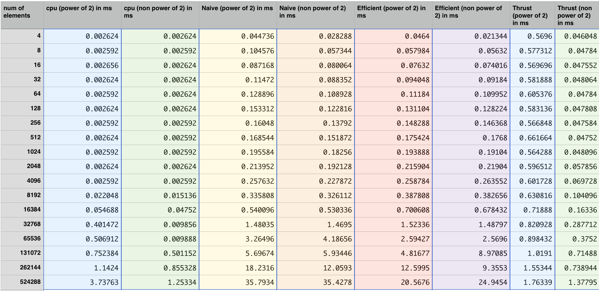
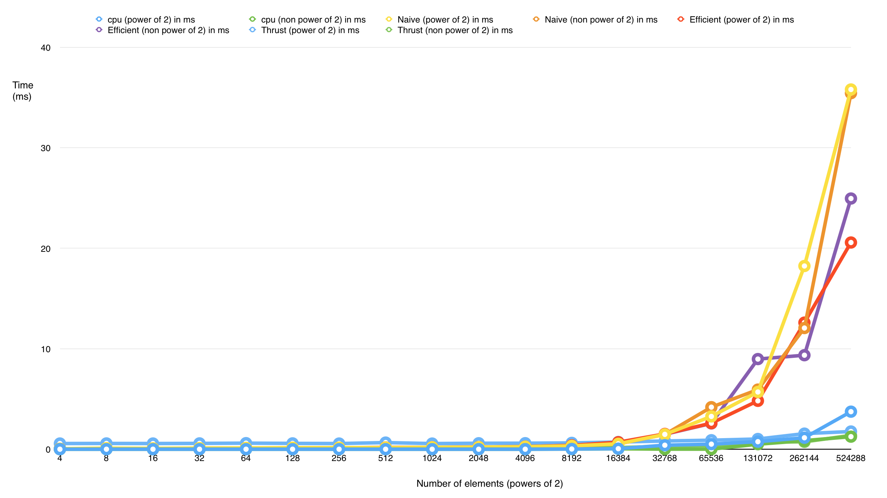

CUDA Stream Compaction
======================

**University of Pennsylvania, CIS 565: GPU Programming and Architecture, Project 2**

* SANCHIT GARG
* Tested on: Mac OSX 10.10.4, i7 @ 2.4 GHz, GT 650M 1GB (Personal Computer)

### SANCHIT GARG: ReadMe

In this assignment, we implemented the exclusive scan and stream compaction algorithm both on the CPU and the GPU. Then we compared their performances. 
References : http://http.developer.nvidia.com/GPUGems3/gpugems3_ch39.html

## Part 1: CPU Scan & Stream Compaction

A serial CPU exclusive scan and stream compaction was implemented.

## Part 2: Naive GPU Scan Algorithm

A Naive GPU exclusive scan and Stream Compaction was implemented.

## Part 3: Work-Efficient GPU Scan & Stream Compaction

The Work-Efficient GPU exclusive scan and Stream Compaction was implemented.

## Part 4: Using Thrust's Implementation

The Thrust library's exclusive scan was also implemented to compare the result with our implementations.

## Part 5: Radix Sort

Implemented the Parallel Radix Sort algorithm as explained in the reference.
A Namespace "Radix"

## Performance Analysis

My implementation observed the following pattern. The time are all in milliseconds. I used 1024 threads per block for all GPU implementation

#### Values

#### Graph

#### Analysis

The bottleneck in the Naive implementation would be copying the output array after every scan step to use it as the input array. Switching the arrays was giving incorrect results.
The bottleneck for the Work-Efficient implementation should be a lot of memory access in the kernel functions. This is a slow process and hence reduces the performance of the implementation. 

### Output

The console output of the program is as follows. Note that a test for Radix Sort was also written. I used the sort function under the header file <algorithm> and compared my implementations result with it. This was done to test the correctness of the Parallel Radix Sort implementation.
	
****************
** SCAN TESTS **
****************
    [  30  41  15  22  11  41  10  37  48  41  44  30  26 ...  20   0 ]
==== cpu scan, power-of-two ====
    [   0  30  71  86 108 119 160 170 207 255 296 340 370 ... 26119 26139 ]
==== cpu scan, non-power-of-two ====
    [   0  30  71  86 108 119 160 170 207 255 296 340 370 ... 26031 26064 ]
    passed 

==== naive scan, power-of-two ====
    [   0  30  71  86 108 119 160 170 207 255 296 340 370 ... 26119 26139 ]
    passed 

==== naive scan, non-power-of-two ====
    [   0  30  71  86 108 119 160 170 207 255 296 340 370 ...   0   0 ]
    passed 

==== work-efficient scan, power-of-two ====
    [   0  30  71  86 108 119 160 170 207 255 296 340 370 ... 26119 26139 ]
    passed 

==== work-efficient scan, non-power-of-two ====
    [   0  30  71  86 108 119 160 170 207 255 296 340 370 ... 26031 26064 ]
    passed 

==== thrust scan, power-of-two ====
    [   0  30  71  86 108 119 160 170 207 255 296 340 370 ... 26119 26139 ]
    passed 

==== thrust scan, non-power-of-two ====
    [   0  30  71  86 108 119 160 170 207 255 296 340 370 ... 26031 26064 ]
    passed 

*****************************
** STREAM COMPACTION TESTS **
*****************************
    [   2   3   3   0   1   1   2   1   2   1   2   0   2 ...   0   0 ]
==== cpu compact without scan, power-of-two ====
    [   2   3   3   1   1   2   1   2   1   2   2   2   3 ...   2   1 ]
    passed 
==== cpu compact without scan, non-power-of-two ====
    [   2   3   3   1   1   2   1   2   1   2   2   2   3 ...   1   2 ]
    passed 
==== cpu compact with scan ====
    [   2   3   3   1   1   2   1   2   1   2   2   2   3 ...   2   1 ]
    passed 
==== work-efficient compact, power-of-two ====
    [   2   3   3   1   1   2   1   2   1   2   2   2   3 ...   2   1 ]
    passed 
==== work-efficient compact, non-power-of-two ====
    [   2   3   3   1   1   2   1   2   1   2   2   2   3 ...   1   2 ]
    passed 

****************
** RADIX SORT **
****************
==== Radix Sort,<sizeAr> elements ====
    [  30  91  15  72  61  41  10  37  98  41  94  80  26  96  10  88 ]
    [  10  10  15  26  30  37  41  41  61  72  80  88  91  94  96  98 ]
    passed 

